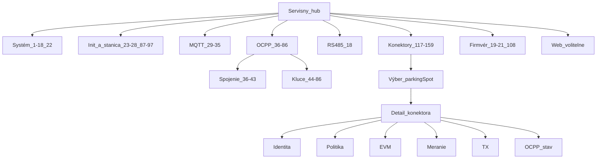

# Servisné menu: plán nad **celým** hárokom Variables

Tento plán je **viazaný na kompletný hárok `Variables`** v súbore [.cursor/rules/TP logic.xlsx](.cursor/rules/TP%20logic.xlsx) (159 platných riadkov ID 1–159; riadok 160 je prázdny).

**Kompletný výpis všetkých stĺpcov** (ID, názov, perzistencia, typ, default, R/RW, OCPP key, popis, zdroj pravdy, poznámka): [tp-logic-variables-full.md](tp-logic-variables-full.md) — generované z Excelu cez Python `openpyxl` (UTF-8).

Štruktúra workbooku (**Basic logic**, listy SYSTEM, TP_INIT, CONNECTIVITY, …) ostáva **doplnkovým rámcom** (poradie a názvy domén). **Primárny register pre obsah servisného menu** je však **Variables**: každý riadok má mať priradené miesto v UI (alebo výnimku „nie v servise“).

---

## 1. Mapovanie **všetkých** ID 1–159 → servisné oblasti

| ID | Rozsah | Prefix / obsah v Exceli | Kde v servise (hub / oblasť) |
|----|--------|---------------------------|------------------------------|
| **1–22** | `system.*` | Android model, sieť, štatistiky, GPS, RS485 ready, globálny FW update stav, lifecycle | Hub **Systém (Touchpoint)**. Podsekcie: zariadenie (1–3), sieť a stav (4–12, 17), traffic (13–16), poloha (17), RS485 (18), **alebo** presunúť **19–21** (`fwUpdate.*`) výhradne pod **Firmvér** (duplicita len ak rozdelíme obrazovky). |
| **23–28** | `operator.*` | Platby, owner, helpdesk, odkazy store, charging link | Hub **Init a stanica / Prevádzkovateľ** (všetko RW podľa stĺpca). |
| **29–35** | `connectivity.mqtt.*` | URL, topic, connectionId, deviceId, password, user | Hub **MQTT** (INIT bootstrap; heslá maskované). |
| **36–43** | `connectivity.ocpp` (nie `.key`) | Verzia, URL, deviceId, basicAuth, registration, offset, heartbeat, boot retry | Hub **OCPP · spojenie a runtime** (mix init + OCPP_RUNTIME). |
| **44–86** | `connectivity.ocpp.key.*` | Štandardné a custom OCPP 1.6 kľúče | Hub **OCPP · konfigurácia (Change/Get)** — vnútri členenie podľa tém (meter, auth, transakcia, charging profile, …). **Pozor: ID 87 už nie je OCPP key.** |
| **87–97** | `station.*` | boundSn, vendor, model, country, vat, defaultLanguage, timeZone, currency, fx, modbusMeter, meterS0count | Hub **Init a stanica** (identita a ekonomické/lokalizačné údaje stanice). |
| **98–116** | `connector[].evm.*` | lastResponse, budget, RCD, lock, manual, FW verzia, HW adresa, CIB, live CP/DO/lock, state | Hub **EV modul** (per konektor), sekcie podľa RW vs runtime. |
| **117–122** | `connector[]` identita | evseCpoId, powerType, phases, maxAmps, plugType, parkingSpot | **Konektor** — karta Identita / INIT. |
| **123–132** | `connector[]` policy | hasPublicPolicy, e-roaming, publicPolicy.* | **Konektor** — karta Politika a ceny. |
| **133–146** | `connector[].activeTx.*` | TX id, meter bookends, tag, user, policy type, price meta, časy, náklady | **Nabíjanie a transakcia** — sekcia **Aktívna TX** (väčšinou R, diagnostika). |
| **147–156** | `connector[].meter.*` | lastResponse, energy, fázy U/I/P, impulzy, stav metra | Hub **Elektromer (ELM)** / Meranie (per konektor). |
| **157–159** | `connector[].ocpp.*` | efektívny status, lastSent, statusChangedAt | **Nabíjanie a TX** alebo **OCPP stav konektora** (DERIVED/OCPP_RUNTIME). |

**Poznámka k číslu 87:** V starších návrhoch sa omylom uvádzalo „OCPP kľúče do 87“ — v skutočnosti **`station.boundSn` je ID 87**; posledný OCPP key je **ID 86** (`MaxChargingProfilesInstalled`).

---

## 2. Vzťah k hárok `Basic logic` (poradie domén)

Hárok **Basic logic** definuje **poradie funkčných celkov** (SYSTEM → TP_INIT → MQTT → OCPP → …). Pri skladaní **hub-u** sa má toto poradie **rešpektovať** pri zlučovaní bublín, ale **množina polí** v každej oblasti je daná **výhradne riadkami Variables** vyššie — nie naopak.

Zoznam hárok a „Basic logic“ ostal v predchádzajúcej verzii platný; detail: pozri sekciu v histórii git alebo doplníme samostatný odkaz, ak treba.

---

## 3. Prvá úroveň hub-u (návrh po zlúčení pre P5L)

Hub položky sú **odvodené od mapovania vyššie**, nie od vymyslených názvov:

| # | Hub (SK) | Pokrýva ID / oblasť |
|---|----------|---------------------|
| 1 | **Systém** | 1–18, 22 (+ voliteľne 19–21 ak nie sú len vo Firmvéri) |
| 2 | **Init a stanica** | 23–28, 87–97 |
| 3 | **MQTT** | 29–35 |
| 4 | **OCPP** | 36–86 (vnútorne: Spojenie 36–43, Kľúče 44–86) |
| 5 | **Nabíjanie a TX** | 133–146, 157–159 (+ logika z Basic logic TX_*) |
| 6 | **RS485** | 18 + logika z hárok RS485 (bez extra riadkov v Variables mimo 18) |
| 7 | **Meranie (ELM)** | 96–97 (stanica), 147–156 (per konektor) |
| 8 | **EV modul** | 98–116 |
| 9 | **Firmvér** | 19–21, 108 (+ flow z hárok EVM_FW_UPDATE) |
| — | **Konektor (výber + karty)** | 117–132 ako podrozcestník podľa `parkingSpot` |

**Web** v aplikácii môže zostať samostatný nástroj; obsahovo súvisí s **28** a **23–27**.

Zlučovanie (napr. **4** jedna bublina „OCPP“ namiesto dvoch) je povolené, ale **nesmie zmazať** rozsah ID 44–86 oproti 36–43 — v UI len oddelené sekcie.

---

## 4. R / RW v servisnom UI

- Stĺpec **R or RW** v [tp-logic-variables-full.md](tp-logic-variables-full.md) určuje: **R** = `serviceFieldRow` read-only; **RW** / **R/RW** = toggle / vstup podľa `type` (boolean, number, string, json array).
- **Perzistentná** (`TRUE`/`FALSE`) — ovplyvňuje, či sa hodnota očakáva v lokálnom úložisku (dôležité pre mock/backend).

---

## 5. Ďalší krok (implementácia — mimo rozsahu tohto plánu)

1. Pre každý hub vyrobiť konkrétne **nadpisy `ServiceSectionCard`** zodpovedajúce podlogikám z príslušných hárok (SYSTEM, CONNECTIVITY, …).  
2. Naviazať mock polia v `App.tsx` na **kľúče z Variables** 1:1.  
3. Pri zmene Excelu znovu spustiť export do [tp-logic-variables-full.md](tp-logic-variables-full.md).

---

## 6. Štruktúra servisného menu (strom)

Nižšie je **jedna konzistentná štruktúra**: globálne veci sú na hub-e, všetko **per `connector[]`** je pod jednou vetvou **Konektory** (technik vyberie miesto / konektor, potom scroll sekciami). Zodpovedá to Excelu (EVM, ELM, TX, OCPP stav sú väzobné na konektor) a znižuje počet bublín na úvodnej obrazovke.

### 6.1 Úroveň 0 — vstup

- **Servisné menu** (`FullscreenOverlay` hub): zoznam `StationRfidQuickAction` bublín.

### 6.2 Úroveň 1 — hub (poradie zhora nadol, zladené s `Basic logic` kde ide)

| Por. | Položka hub-u | Variables (ID) | Poznámka |
|------|----------------|-----------------|----------|
| 1 | **Systém** | 1–18, 22 | Zariadenie, sieť, traffic, poloha, RS485 ready, lifecycle. **19–21** tu *nie* — len vo **Firmvér** (alebo krátky odkaz / duplicita podľa UX). |
| 2 | **Init a stanica** | 23–28, 87–97 | Prevádzkovateľ + identita a ekonomika stanice (vrátane **92** jazyk, **96–97** typ merania stanice). |
| 3 | **MQTT** | 29–35 | Bootstrap MQTT. |
| 4 | **OCPP** | 36–86 | Pozri **6.3** (podúrovne). |
| 5 | **RS485 a zbernica** | 18 + logika z hárok RS485 | Premenná **18** + texty z listu RS485 (nie sú všetky ako samostatné riadky v Variables). |
| 6 | **Konektory** | 117–159 (okrem 96–97) | Pozri **6.4** — výber konektora, potom sekcie. |
| 7 | **Firmvér** | 19–21, 108 | Globálny stav FW + verzia v EVM (**108**). |
| 8 | **Web** (voliteľné) | 23–27, 28 | Nástroj; hodnoty sú aj v Init / prevádzkovateľ. |

**Spolu 7–8 bublín** na hub-e (bez Webu 7).

### 6.3 Úroveň 2 — pod **OCPP** (jedna položka hub-u, dva scrolly alebo pod-bubliny)

Odporúčanie: **dve pod-bubliny** (menej nekonečného scrollu než 43 kľúčov naraz).

```
OCPP
├── Spojenie a beh (overlay 1)
│   └── ID 36–43 — init URL/device/auth + runtime registration, čas, heartbeat, retry
└── Konfigurácia (overlay 2)
    └── ID 44–86 — všetky `connectivity.ocpp.key.*` v sekciách podľa témy:
        • Meter / MeterValues (48, 56–60, 68–71, …)
        • Autorizácia / Local list (44–45, 53–54, 78–81, …)
        • Transakcia / Stop / Unlock (66–67, 74–76, …)
        • Nabíjanie / profily (82–86, 64–65, …)
        • Sieť / WebSocket / Heartbeat OCPP (51, 77, …)
        • Ostatné (46–47, 52, 61–63, 72–73, …)
```

Alternatíva: jeden overlay **OCPP** s viacerými `ServiceSectionCard` nadpismi (dlhší scroll).

### 6.4 Úroveň 2 — pod **Konektory**

```
Konektory
├── (výber) Zoznam konektorov — bubliny podľa `parkingSpot` (z mock/init)
└── Detail pre vybraný konektor (jeden `FullscreenOverlay`, vertikálny scroll)
    ├── Identita — 117–122
    ├── Politika a e-roaming — 123–132
    ├── EV modul (EVM) — 98–116
    ├── Meranie (ELM/EVM) — 147–156
    ├── Aktívna transakcia — 133–146 (diagnostika, R)
    └── OCPP stav konektora — 157–159
```

**96–97** (globálne `station.modbusMeter`, `station.meterS0count`) ostávajú v **Init a stanica**, nie v detaile konektora.

### 6.5 Diagram závislostí (zjednodušene)



### 6.6 Čo tým nie je pokryté

- Hárok **ENUM SOURCE** — referencia pre vývojárov, nie položka menu (prípadne DEV).
- Podlogiky z hárok **TX_AND_CHARGING_STATE**, **OCPP_***, **EVM_*** — v UI reprezentované ako **sekcie / tooltips** pri príslušných premenných, nie ako duplicitné stromy paralelné k Variables.

---

*Posledná úprava: pridaná sekcia 6 — strom menu; plán explicitne nad celým hárokom Variables; opravené rozsahy OCPP kľúčov 44–86 a `station.*` od ID 87; export v [tp-logic-variables-full.md](tp-logic-variables-full.md).*
